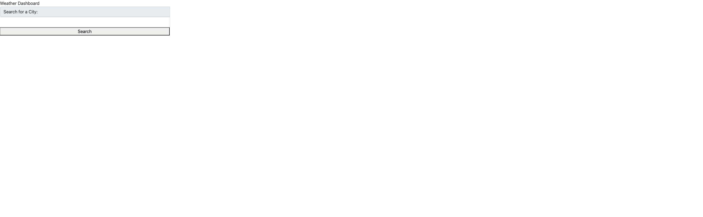
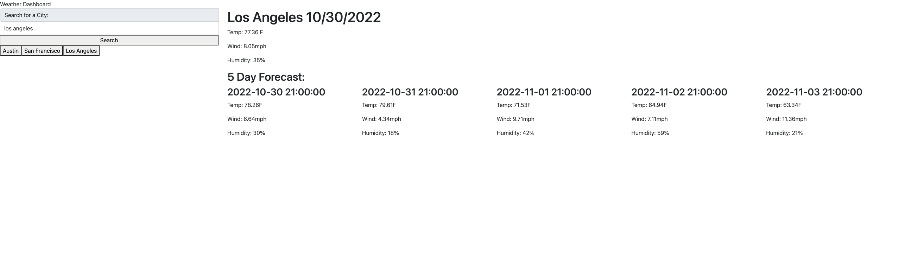

# ChallengeSix
Weather API dashboard

## Description
The following app shows current weather data given from the openweather API based on a users search input for a given city. The app also displays weather data for a 5 day forcast. Due to the API functionality the data is pulled once every 24 hours from the time of the search since the hourly forcast was free and not the daily forcast. Once selected a button is created and put into local storage so that the user can refresh the page or close out entirely and the recent citys will still be displayed as buttons. Once each button is clicked the city is called through the API once more so that the current weather data and forcast data is refreshed.

## Future Work
Update CSS to add style to the project

## Deployed URL
https://mtbell412.github.io/ChallengeSix/

## Screenshots

